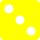
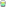

## svg animations

<div align="center">

|  |  |  |  |
|---|---|---|---|

</div>

svgs are the most popular extension for vector images, unlike raster images (jpg, png ...) vector images don't contain pixels but calculations of the shapes that make the final image

this makes them easier to scale without the quality loss and it usually makes them take smaller file size if you are working with simple shapes

<br>

quick links:
* [the basic layout](https://github.com/junguler/_svg-css-animations#the-basic-layout-of-svg-images)
* [apply you own stylings](https://github.com/junguler/_svg-css-animations#apply-your-own-styling-css-to-svg)
* [apply transparency using colors](https://github.com/junguler/_svg-css-animations#applying-transparency-using-the-color)
* [gradients in svg](https://github.com/junguler/_svg-css-animations#gradients-in-svg)
* [apply animations to svg](https://github.com/junguler/_svg-css-animations#apply-animations-to-your-svg)
* [basic info about filters](https://github.com/junguler/_svg-css-animations#different-filters-in-css)
* [difference between text and path](https://github.com/junguler/_svg-css-animations#differences-between-path-and-text-in-svg)
* [add gradient to newly made paths](https://github.com/junguler/_svg-css-animations#add-gradient-to-our-newly-made-text-to-path)
* [combine different shapes in svg](https://github.com/junguler/_svg-css-animations#combine-all-shapes-together)
* [use nerd font glyphs](https://github.com/junguler/_svg-css-animations#use-nerd-fonts-glyphs)
* [handling motion in animation](https://github.com/junguler/_svg-css-animations#handling-motion-in-an-animation)
* [specify gradient angle](https://github.com/junguler/_svg-css-animations#gradient-angle)
* [real world examples](https://github.com/junguler/_svg-css-animations#real-world-examples)
* [mouse hover effect](https://github.com/junguler/_svg-css-animations#mouse-hover-effect)
* [transform svgs](https://github.com/junguler/_svg-css-animations#transform-svgs)
* [animation steps](https://github.com/junguler/_svg-css-animations#animation-steps)
* filter examples
  * [hue-rotate](https://github.com/junguler/_svg-css-animations#hue-rotate-filter-examples)
  * [blur filter](https://github.com/junguler/_svg-css-animations#blur-filter-example)
  * [invert filter](https://github.com/junguler/_svg-css-animations#invert-filter-example)
  * [greyscale filter](https://github.com/junguler/_svg-css-animations#greyscale-filter-example)
* [acknowledgement](https://github.com/junguler/_svg-css-animations#acknowledgement)

<br>

## the basic layout of svg images
svgs are very easy to modify since they are made of calculations, if we open a svg file with a text editor you can see that it's actually really easy to understand

everything is inside tags `<>` with the `svg` tag containing everything, here is the code for a very simple svg image of a rectangle i quickly made in inkscape so we can take a look inside 
```
<svg width="47.404mm" height="21.129mm" version="1.1" viewBox="0 0 47.404 21.129" xmlns="http://www.w3.org/2000/svg">
<rect width="47.404" height="21.129" style="fill:#20a6ff;paint-order:markers fill stroke"/>
</svg>
```


the svg tag contains the width and height of our image, note that this is the value you decided in your svg editor and can be easily changed, the reason for these to exist is so we can have a default value.

the rect tag here contains x coordinates, width and height and some styling we applied in our svg editor (in my case inkscape)

note that this rect tag was created because i made a very simple rectangle image, if we make a more complex shape this tag changes depending the complexity, here is another example:
```
<svg width="48.157mm" height="45.893mm" version="1.1" viewBox="0 0 48.157 45.893" xmlns="http://www.w3.org/2000/svg">
<path transform="matrix(.26458 0 0 .26458 9.3567 12.131)" d="m111.22 127.6-56.061-29.92-56.429 29.219 11.132-62.563-45.227-44.638 62.941-8.7459 28.477-56.807 27.768 57.157 62.827 9.5292-45.779 44.071z" style="fill:#20a6ff;paint-order:markers fill stroke"/>
</svg>
```


here inkscape has assigned the path tag to our more complex image and we can see that extra styling has also been applied

<br>

## apply your own styling css to svg
now that we know the basic of how svgs are set up with can apply our own stylings to these files so take the above example with the star and lets remove the style section from it, for ease of showing i will not include the svg tag from further examples.
 ```
<path transform="matrix(.26458 0 0 .26458 9.3567 12.131)" d="m111.22 127.6-56.061-29.92-56.429 29.219 11.132-62.563-45.227-44.638 62.941-8.7459 28.477-56.807 27.768 57.157 62.827 9.5292-45.779 44.071z"/>
 ```
now lets apply css to this path tag, make a new line below svg tag and above the path tag, open a style tag and lets do apply a simple fill color
 ```
<style>
path {
fill: magenta;
}
</style>
```
so the whole thing become like this

<details>
  <summary>click me to read</summary>
  
<br>

```
<svg width="48.157mm" height="45.893mm" version="1.1" viewBox="0 0 48.157 45.893" xmlns="http://www.w3.org/2000/svg">

<style>
path {
fill: magenta;
}
</style>

<path transform="matrix(.26458 0 0 .26458 9.3567 12.131)" d="m111.22 127.6-56.061-29.92-56.429 29.219 11.132-62.563-45.227-44.638 62.941-8.7459 28.477-56.807 27.768 57.157 62.827 9.5292-45.779 44.071z"/>

</svg>
```
 
</details>


the color can also be hex `#FF00FF` or `rgb(255, 0, 255)` with the exact same result

<br>

## applying transparency using the color
using hex and rgba colors we can apply transparency (alpha) to these colors as well
 ```
<style>
path {
fill: rgba(255, 0, 255, 0.5);
}
</style>
```


above example applies 50% opacity to the magenta color, same thing can be achieved by `#FF00FF70`

<br>

## gradients in svg
applying gradient to svg is done by using the gradient tags like `linearGradient` and `radialGradient` tags, here is a simple example for lineargradient for fill color, apply this at the bottom of you style tag and above the actual svg
```
<linearGradient id="grad">
<stop offset="0%" stop-color="cyan" />
<stop offset="100%" stop-color="magenta" />
</linearGradient>
```
you are not limited in setting up these gradients at all and it does not need to start at 0% and end at 100% either, you can have as many colors as you want and at any point you want, either with transparency (alpha) or not, here is another more involved example
```
<linearGradient id="grad">
<stop offset="20%" stop-color="cyan" />
<stop offset="50%" stop-color="rgba(255, 127, 0, 0.5" />
<stop offset="70%" stop-color="#ff00ff22" />
</linearGradient>
```

as you can see we need to assign an id to this gradient tag and i named mine `grad`, now change your style to include this id and apply the gradient
 ```
<style>
path {
fill: url(#grad);
}
</style>
```
so the whole file becomes like this 
<details>
  <summary>click me to read</summary>
  
<br>

```
<svg width="48.157mm" height="45.893mm" version="1.1" viewBox="0 0 48.157 45.893" xmlns="http://www.w3.org/2000/svg">

<style>
path {
fill: url(#grad);
}
</style>

<linearGradient id="grad">
<stop offset="0%" stop-color="cyan" />
<stop offset="100%" stop-color="magenta" />
</linearGradient>

<path transform="matrix(.26458 0 0 .26458 9.3567 12.131)" d="m111.22 127.6-56.061-29.92-56.429 29.219 11.132-62.563-45.227-44.638 62.941-8.7459 28.477-56.807 27.768 57.157 62.827 9.5292-45.779 44.071z"/>

</svg>
```
</details>


<br>

## apply animations to your svg
applying animations is easy using css, all you need to do is define a keyframe, assign a name to it and define start and end points to it, lets show a simple example
```
@keyframes test_anim {
0% {
filter: invert(0%);}
100% {
filter: invert(100%);}
}
```
you can also use `from` and `to` instead of `0%` and `100%` if you only need 2 points for your animation but using the percentages is easier and gives you more control, because these are stylings we apply to these svg files they should also be inside the style tags as your other css

so we made our first animation but why did it not do anything? because you haven't applied it to your path tag yet so lets do that now
```
path {
fill: url(#grad);
animation: test_anim linear 2.5s infinite alternate;
}
```
what happened? so we tell css we want to apply an `animation` to this path tag, we apply the name of our animation `test_anim`, set the style of animations we want to use `linear` this can be `ease`, `ease-in-out` and some extra variants, specify the animation length set to `2.5s` seconds in this example and apply this animation `infinite` infinitely and `alternate` makes sure to go back and forth to not have a jarring finish to the animation

here is how it comes together 

<details>
  <summary>click me to read</summary>
<br>
 
```
<svg width="83.166mm" height="79.839mm" version="1.1" viewBox="0 0 83.166 79.839" xmlns="http://www.w3.org/2000/svg">

<style>
@keyframes test_anim {
0% {
filter: invert(0%);}
100% {
filter: invert(100%);}
}

path {
fill: url(#grad);
animation: test_anim linear 2.5s infinite alternate;
}
</style>

<linearGradient id="grad">
<stop offset="0%" stop-color="cyan" />
<stop offset="100%" stop-color="magenta" />
</linearGradient>

<path transform="matrix(.26458 0 0 .26458 9.3567 12.131)" d="m111.22 127.6-56.061-29.92-56.429 29.219 11.132-62.563-45.227-44.638 62.941-8.7459 28.477-56.807 27.768 57.157 62.827 9.5292-45.779 44.071z"/>

</svg>
```
</details>


<br>

## different filters in css
there are a bunch of filters we can apply in our animations, for a complete explanation on them go this [page](https://developer.mozilla.org/en-US/docs/Web/CSS/filter) but here is simple table to gives you the summery

<div align="center">

| filter | minimum | maximum | default | info |
|---|---|---|---|---|
| `blur()` | 0px | n/a | 0px | apply blur effect |
| `brightness()` | 0.0 | n/a | 1.0 | assign brightness value |
| `contrast()` | 0% | n/a | 100% | assign contrast value |
| `drop-shadow()` | 0px | n/a | 0px | apply drop shadowing |
| `grayscale()` | 0% | 100% | 0% | apply grayscale (black and white) |
| `hue-rotate()` | 0deg | 360deg | 0deg | rotate hue (change colors) can also be a negative value |
| `invert()` | 0% | 100% | 0% | invert colors |
| `opacity()` | 0% | 100% | 100% | change opacity(alpha) |
| `saturate()` | 0% | n/a | 100% | saturate colors |
| `sepia()` | 0% | 100% | 0% | apply sepia (old timey color) |

</div>

chaining filters is easy too, just do this:
```
filter: invert(75%) hue-rotate(180deg);
```

## differences between path and text in svg
when you type a text in a svg editor it's saved as text file by default, this makes this svg smaller than if we changed it to path but the problem is everyone needs to have the same font installed on their computer to see how you intended that text file to be shown.

because of this we convert these texts to paths so we can have a unified look, in inkscape this is done by

1- click on the T icon in the toolbox and write something

2- click on the select icon and at the top bar put `0` in the `X` and `Y` sections, this forces the text at the top most left part of the frame

3- in the edit menu click on `resize page to selection`, this changes the frame to the size of your writing

4- in the path menu click on the `object to path`
now you can save the file as `optimized svg` for ease of use i applied an brown color to all of the words


<br>

## add gradient to our newly made text to path
doing the same method as before let's apply a gradient to this shape, remember to remove any styling if there was any (in my case i had set some for the color to be able to show it here)

```
<style>
path {
fill: url(#grad);
}
</style>

<linearGradient id="grad">
<stop offset="0%" stop-color="cyan" />
<stop offset="100%" stop-color="magenta" />
</linearGradient>
```


as you can see each word has this gradient applied to it individually, if you want a gradient to be applied the whole word you need to combine all these shapes together which i will show on the next section

<br>

## combine all shapes together
in inkscape click on the words and in the `path` menu click on `combine` and save the file again and do the same thing as the step above


<br>

## use nerd fonts glyphs
nerd fonts are a collection of free and opensource fonts that have many glyphs patched to them, find the repo [here](https://github.com/ryanoasis/nerd-fonts) and check the website [here](https://www.nerdfonts.com/) and [download](https://www.nerdfonts.com/font-downloads) any one of the fonts you like and install it to your system, restart inkscape and go to the [cheat sheet](https://www.nerdfonts.com/cheat-sheet) section of the website and find a glyph you like.


click on the icon and go to inkscape and using the T icon the the toolbar paste the glyph into the page, click on it and move to `0` at `X` and `Y` as before and from the `edit` menu `resize page to selection` just like before and save it


the same method for applying gradients and animation can be applied to this glyph as well, like i said these svg files can be resize to any size you want and let's showcase that using a bit of html inside this markdown file
```

```


<br>

## handling motion in an animation
depending on the number of seconds you want to run an animation it might look very different, we can also use other methods to make an animation look slower or faster than it already is using `linear`, `ease`, `ease-in-out` and some others, the easiest way to give you an idea is to show you

<div align="center">

| linear | ease | ease-in-out |
|--|--|--|
|  |  |  |

</div>

<br>

## gradient angle
so far we've only used the angle `0` or used a gui svg editor (inkscape in my case) to set a custom gradient angle for our images but we can also specify it inside the starting gradient tag
```
<linearGradient id="grad" gradientTransform="rotate (45)">
```
everything else can be the same as before

<div align="center">

| 0 degree | 45 degrees | 90 degrees |
|---|---|---|
|  |  |  |

</div>

<br>

## real world examples
i'm going to add some examples i've done using the nerd font glyphs here over time so you can get a feel for what's possible, if you want to see the code just click on the picture and hit the `<>` `display source blob` button at the top right

<div align="center">

| Xbox | Playstation | Sun | Moon |
|---|---|---|---|
|  |  |  |  |

| Magnet | Cog | Thumbs up/down | Good/Bad |
|---|---|---|---|
|  |  |  |  |

</div>

<br>

## mouse hover effect
because we are using css to apply effects to these svg files we also have access to `:hover` which only activates when your mouse is hovered over the content of a specific tag, knowing this let's apply it these two svg files, make a copy of all the content in your `path` tag and add the `:hover` at the end of it

```
path {
fill: url(#grad);
animation: animate linear 5s infinite ;
}
path:hover {
fill: url(#grad);
animation: animate linear 1s infinite ;
}
```
above example changes the speed of our animation from 5 seconds to 1 seconds when the mouse is hovered over the image

here is another example but with a different gradient this time, copy paste everything inside your gradient tag, change the colors na give it a new name 
```
<linearGradient id="grad">
<stop offset="0%" stop-color="#f0f" />
<stop offset="100%" stop-color="#0ff" />
</linearGradient>
<linearGradient id="gradhover">
<stop offset="0%" stop-color="#ff0" />
<stop offset="100%" stop-color="#0f0" />
</linearGradient>
```

note: because of how github renders it's pages and applies it's own css to everything you are not able to see the effect in this page, just click on any of the 2 images and it will open in a new page as raw svg and hover your mouse over them

<div align="center">

| Hover over to speed up | Hover over to change colors |
|--|--|
|  |  |

</div>

<br>

## transform svgs
transfrom gives us the ability to move around our svgs and when we apply it inside a animation it will gives you a custom motion

for a complete roundown on everything that's possible check [this page](https://www.w3schools.com/cssref/css3_pr_transform.asp) 

showing things in motion is way better than explaining so i will get to the point, inside your `@animation` do something like this
```
@keyframes animate {
50% {
transform: scaleX(-1);
transform-origin: center;}
}
```
this will be flip your image on it's x axis or horizontally, a note about `transform-origin: center;` it is needed because by default the picture is turned around it's top left position, lets show this in action

<div align="center">

| transform-origin: left | transform-origin: center | transform-origin: right |
|---|---|---|
|  |  |  |

</div>

note that this transform-origin can also be set in you path tag to save on repeated words, the `50% { }` set inside the animation tells css that start from the normal position, turn the image at 50% and go back to normal position again

now that we have the explaining out of the way lets show some examples on what can be done, note that this is just some examples of what can be done

<div align="center">

| scaleY(-1) | rotate(360deg) | rotate(-360deg) | scaleX(-1) rotate(180deg) |
|---|---|---|---|
|  |  |  |  |

| 0% skew(15deg, 15deg) -> 100% skew(-15deg, -15deg) | skew + rotate |
|---|---|
|  |  |

</div>

<br>

## animation steps
so far every examples i've shown was about animating in a smooth motion, using `steps()` we can change the smoothness of these animations
```
animation: animate steps(5) 2.5s infinite;
```
above forces this animation to be played in 5 steps, here is visual example with different numbers

| steps(5) | steps(10) | steps(15) | steps(20) | steps(25) | steps(30) |
|---|---|---|---|---|---|
|  |  |  |  |  |  |

<br>

## hue-rotate filter examples
the hue-rotate filter changes the position of colors, you can think of it as a rainbow that changes the position of it's colors, these colors move in 360 degrees circle where 0 and 360 gives you the same color, so a 180 degree hue-rotation changes a cyan color to red and so on, knowing this we can make a smooth motion that constantly moves our colors along
```
<style>
@keyframes animate {
0% {
filter: hue-rotate(0deg);}
100% {
filter: hue-rotate(360deg);}
}
path {
animation: animate linear 2.5s infinite ;
}
</style>
```

here is some nerd font glyphs that i slightly adjusted and applied a gradient color to in inkscape, note that with the paintcan image i wanted the animation to go in reverse motion so i added a `-` negative to the hue-rotate filter in the 100% section like this ``filter: hue-rotate(-360deg);``

 &nbsp;  &nbsp; 

<br>

## blur filter example
applying blur effect is also easy
```
<style>
@keyframes animate {
25% {
filter: blur(0px);}
100% {
filter: blur(1px);}
}
path {
animation: animate ease-in-out 2.5s infinite alternate ;
}
</style>
```


note that i started the animation at 25% which means that the first 25% of this 2.5s does not apply any filters to this image, i also used ease-in-out which slows down the start and end of the animation, the alternate at the end makes sure to loop the animation correctly as it's not like the hue-rotate example and the end and start of this animation is not the same

<br>

## invert filter example

```
<style>
@keyframes animate {
0% {
filter: invert(0%);}
100% {
filter: invert(100%);}
}
path {
animation: animate ease-in-out 2.5s infinite alternate ;
}
</style>
```


<br>

## greyscale filter example

```
<style>
@keyframes animate {
0, 10% {
filter: grayscale(0%);}
90%, 100% {
filter: grayscale(100%);}
}
path {
animation: animate ease-in-out 2.5s infinite alternate ;
}
</style>
```

notice how i applied the filters to 0% and 10% and 90% and 100%, this is not usually needed but if you find your animation has a glitch in (like it was with mine) you can avoid it completely by adding both sets of numbers


<br>

## acknowledgement
this repo and my profile banner was inspired by cool tricks from this [page](https://github.com/sindresorhus/css-in-readme-like-wat), please go give his repo a star to thank him for his great work
